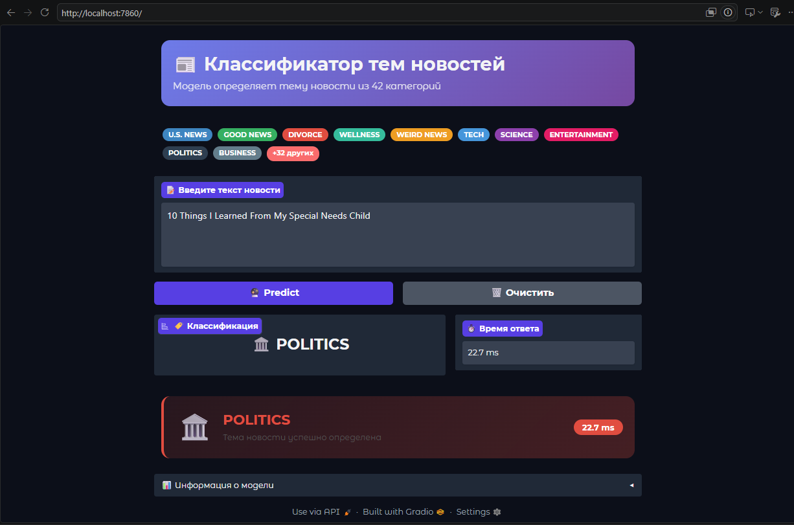
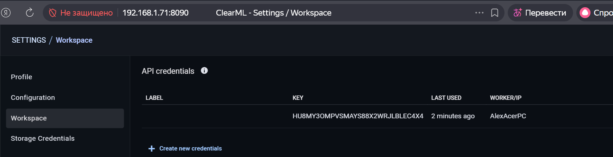
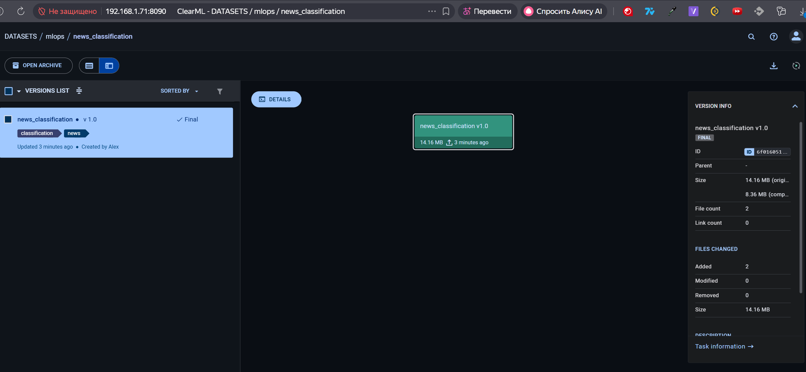
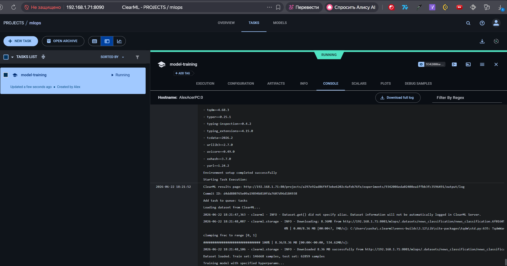
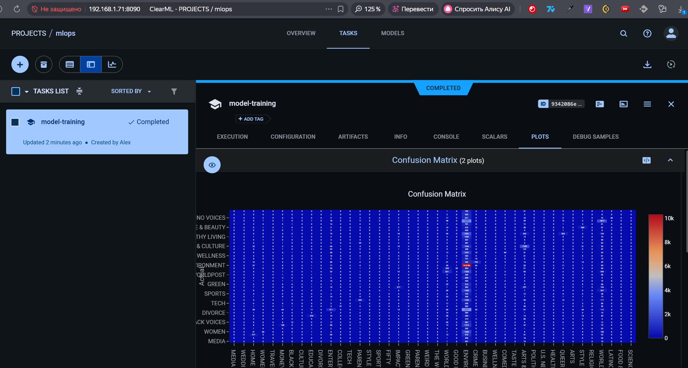
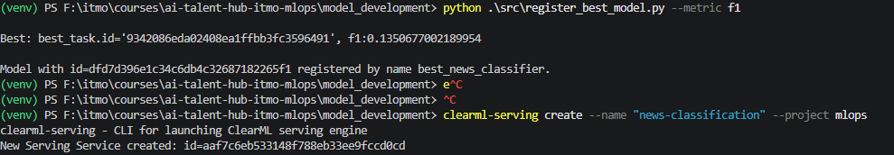
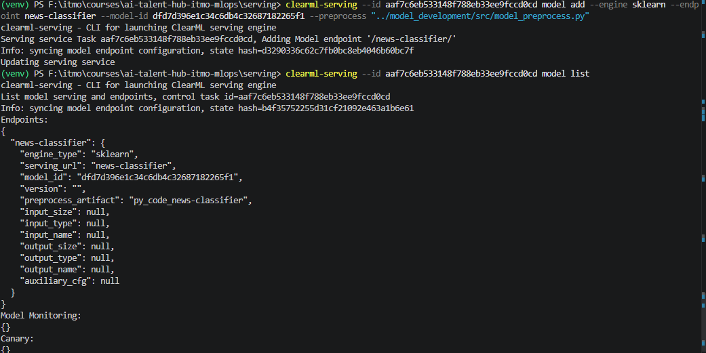
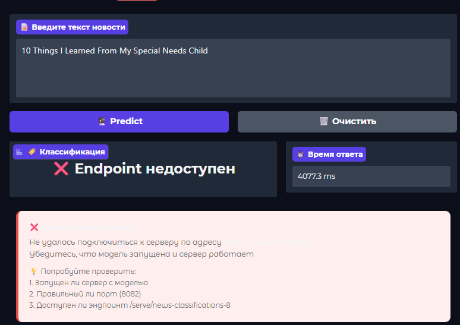

# ai-talent-hub-itmo-mlops - Курсовой проект

Реализован сервис классификации новостей по их тексту с использованием ClearML. Здесь главный упор сделан на проработку минимального жизненного цикла ML-модели:

<p align="center">
      
</p>

## Шаги

1. Получение и предобработка датасета, разделение на подвыборки через train_test_split для обучения модели;
2. Регистрация датасета в сервисе ClearML Dataset;
3. Обучение нескольких моделей через запущенный удаленный ClearML Agent, позволяющий запустить обучение на другой машине;
4. Логирование метаданных и метрик обучения для дальнейшего выбора наилучшей модели;
5. Публикация лучшей модели по выбранному параметру в ClearML Model Registry;
6. Развертывание инфрастуктуры ClearML Serving и деплой через неё выбранной модели;
7. Приложение на Gradio, которое предоставляет UI для демонстрации работы модели и её вызов через HTTP endpoint, без необходимости иметь модель локально.

## Технологии

- Python
- Docker Compose
- ClearML Infrastracture (Server, Agent, Serving, ...)
- ScikitLearn
- Gradio (UI)

---

## Структура проекта

```text
.
├── app
│   ├── src - folder with UI files
│   ├── config.py - UI configuration
│   └── main.py - main file for running UI app    
├── model_development
│   ├── configs
│   │   └── clearml.conf - main configuration file for working with clearml inside docker
│   ├── src
│   │   ├── config.py - configuration file for whole clearml infrastructure
│   │   ├── create_dataset.py - script for generating and upload dataset to clearml
│   │   ├── train_model.py - script for training model, call remote exec training on agent and upload to clearml 
│   │   ├── register_best_model.py - script for find and register best model based on f1 or accuracy metric
│   │   ├── model_preprocess.py - preprocessing class for clearml serving service
│   │   └── utils - folder with help functions
│   ├── docker-compose-base-clearml.yml - docker compose configuration for clearml data prep and model training
│   └── requirements.txt
├── serving
│   ├── serving.Dockerfile - custom docker image for ClearML serving with additional requirements
│   ├── docker-compose-serving.yml - docker compose configuration for ClearML serving, mainly from https://github.com/clearml/clearml-serving/blob/main/docker/docker-compose.yml
│   ├── requirements.txt
│   └── .env.example
└── README.md
```

## Запуск

### 1. Git clone

```bash
git clone <url>
cd ai-talent-hub-itmo-mlops
```

### 2. Venv

```bash
python -m venv .venv
source ./venv/bin/activate
```

### 3. Работа с ClearML Server

1. Развернуть docker compose со всем необходимым для CLearML сервера
    - Перейти в директорию связанную с обучением моделей и доустановить необходимые зависимости:

        ```bash
        cd model_development;
        pip install -r requirements.txt
        ```

    - Запустить ClearML сервисы

        ```bash
        docker compose -f ./docker-compose.complete.yml up -d
        docker compose ps
        ```

    - Получить свой IP-адрес (ipconfig for Windows, ifconfig for Linux)
    - После запуска должны быть доступны:
      - Web UI: `http://<IP_ADDRESS>:8090`
      - API: `http://<IP_ADDRESS>:8008`
      - Fileserver: `http://<IP_ADDRESS>:8081`

2. Получить credentials для работы с clearml через SDK.

    - Для этого необходимо выполнить <http://<IP_ADDRESS>:8090> => Settings => Workspace => Create new credentials => Скопировать все credentials
    - Выполнить clearml-init
    - Ввести полученные credentials по инструкции, при необходимости заменить localhost на IP-адрес
    - Скопировать файл в [./configs](./configs/clearml.conf)
    - Отредактировать [файл](./src/config.py) с настройками

    <p align="center">
        
    </p>

3. Перезапустить сервисы ClearML, чтобы внутрь пробросились credentials

    ```bash
    docker compose -f ./docker-compose.complete.yml down 
    docker compose -f ./docker-compose.complete.yml up -d
    ```

4. Подготовка и загрузка датасета, по окончании будет создан датасет в ClearML в соотвествии с параметрами в [конфигурации](./src/config.py)

    ```bash
    python ./src/create_dataset.py
    ```

    После этого датасет появиться в разделе `Datasets` в ClearML UI.

    <p align="center">
        
    </p>

5. Запуск ClearML Agent

    - Скопировать название очереди из [конфигурации](./src/config.py)
    - Запустить агента в отдельном терминале и держать запущенным до конца обучения моделей

        ```bash
        clearml-agent daemon --queue <QUEUE_NAME> --create-queue
        ```

    - Агент появиться в UI и начнет слушать выбранную очередь.

6. Обучение модели

    - В качестве примера используется pipeline CountVectorizer + RandomForestClassifier
    - Для конфигурации параметров обучения необходимо передать их в качестве аргументов для [скрипта обучения](./src/train_model.py). Доступны:
        - max_features (Count Vectorizer max features)
        - ngram_min (Count Vectorizer ngram range min)
        - ngram_max (Count Vectorizer ngram range max)
        - n_estimators (RandomForest n_estimators)
        - max_depth (RandomForest max depth)
        - local (Option to run locally training script without remote execution, for testing)

    - Запустить обучение. В качестве примера можно использовать две конфигуации:
        - Вариант 1:

            ```bash
            python ./src/train_model.py
            ```

        - Вариант 2:

            ```bash
            python ./src/train_model.py --ngram_min 2 --ngram_max 10 --n_estimators 200 --max_depth 50
            ```

    <p align="center">
        
    </p>

    - Во время обучения происходит следующее:
        - генерируется новый ClearML Task;
        - направляет задачу в очередь <QUEUE_NAME>;
        - агент видит это и запускает удаленное обучение;
        - по параметрам конфигурации находится последняя версия датасета и скачивается;
        - происходит обучение модели с указанными параметрами;
        - логируются:
          - метаданные;
          - метрики;
          - confusion matrix.
        - сохраняет pipeline как Output модель на fileserver для дальнейшего доступа из serving.

    <p align="center">
        
    </p>
  
7. Публикация лучшей модели в Model Registry

    - Запустить скрипт, который среди всех моделей выберет наилучшую по одной из метрик

    ```bash
    python ./src/register_best_model.py --metric f1/accuracy
    ```

    - Проверить, что изменился статус модели на `Published`
        - модель видна в `Models`;
        - статус `Published`;
        - есть теги и `MODEL URL`.

    - Записать значение <MODEL_ID>, которое выдает скрипт

    <p align="center">
        
    </p>

### 4. Работа с ClearML Serving

1. Создать serving service и сохраните выданный <SERVICE_ID>

    ```bash
    clearml-serving create --name "news-classification" --project <PROJECT_NAME>
    ```

2. Настроить `.env` файл

    Скопируйте файл `.env.example` в `.env.serving`:

      ```env
      CLEARML_WEB_HOST=http://<IP_ADDRESS>:8090
      CLEARML_API_HOST=http://<IP_ADDRESS>:8008
      CLEARML_FILES_HOST=http://<IP_ADDRESS>:8081
      CLEARML_API_ACCESS_KEY=<YOUR_ACCESS_KEY>
      CLEARML_API_SECRET_KEY=<YOUR_SECRET_KEY>
      CLEARML_SERVING_TASK_ID=<SERVING_SERVICE_ID>
      ```

3. Развернуть docker compose со всем необходимым для CLearML Serving
    - Перейти в директорию связанную с обучением моделей и доустановить необходимые зависимости:

        ```bash
        cd ../serving;
        ```

    - Запустить сервисы

        ```bash
        docker compose --env-file .env.serving -f ./docker-compose-serving.yml up -d --force-recreate
        docker compose --env-file .env.serving -f ./docker-compose-serving.yml ps
        ```

    - Serving будет доступен на `http://<HOST_IP>:8082`

4. Добавить endpoint в ClearML Serving

    - Команда для добавления:

      ```bash
      clearml-serving --id <SERVICE_ID> model add \
        --engine sklearn \
        --endpoint news-classifier \
        --model-id <MODEL_ID> \
        --preprocess "../model_development/src/model_preprocess.py"
      ```

    - Проверка, что endpoint настроен

      ```bash
      clearml-serving --id <SERVICE_ID> model list
      ```

      <p align="center">
            
      </p>

    - Проверка, что Processing для работы с моделью работает корректно:

      ```bash
        curl -X POST "http://localhost:8082/serve/news-classifier" \
        -H "Content-Type: application/json" \
        -d '{"text": "Talking While Making Left Turns Is Distracting, Study Finds"}'
      ```

    - Для Windows можно воспользоваться:

        ```bash
        Invoke-RestMethod -Uri "http://localhost:8082/serve/news-classifier" -Method POST -ContentType "application/json" -Body '{"text":"Talking While Making Left Turns Is Distracting, Study Finds"}'
        ```

    - Пример ответа:

      ```json
      {"label": "WELLNESS"}
      ```

### 5. Запуск UI app

1. Настроить [конфиг файл](./app/config.py)
2. Запустить UI:

    ```bash
    cd ../app;
    pip install -r requirements.txt
    python ./main.py
    ```

3. Открыть (default):

    ```text
    http://localhost:7860
    ```

    <p align="center">
            
      </p>

4. На странице приложения есть красивый UI для удобной проверки работы модели:
    - поле, куда нужно ввести текст новостной статьи;
    - кнопка `Predict`;
    - отображение итоговой темы новости `label`;
    - отображение времени работы `latency`;
    - обработки различных ошибок, если endpoint недоступен, появилась новая тема из при обновленной модели, неправильном парсинге данных и др.

    <p align="center">
            
      </p>
